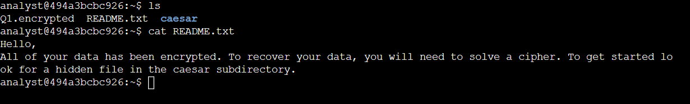
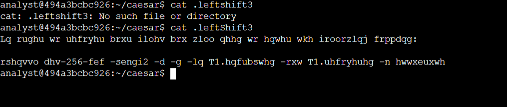

# Decryption Lab
In this Lab, I will decrypt an encrypted message using Ceasar Cypher, one of the earliest cryptographic algorithms.

In this lab activity, I’ll be guided through some basic cryptographic activities using Linux commands to decrypt files and reveal hidden messages.

## Scenario

In this scenario, all of the files in your home directory have been encrypted. You’ll need to use Linux commands to break the Caesar cipher and decrypt the files so that you can read the hidden messages they contain.

**Note:** The lab starts with you logged in as user `analyst`, with your home directory, `/home/analyst`, as the current working directory.

## Task 1. Read the contents of a file

The lab starts in your home directory, `/home/analyst`, as the current working directory.

In this task, you need to explore the contents of your home directory and read the contents of a file to get further instructions.

1. Use the `ls` command to list the files in the current working directory.
Two files, `Q1.encrypted` and `README.txt`, and a subdirectory, `caesar`, are listed:

```files
Q1.encrypted  README.txt caesar
```
The `README.txt` file contains an important message with instructions you need to follow.

2. Use the `cat` command to list the contents of the `README.txt` file.

The message in the `README.txt` file advises that the caesar subdirectory contains a hidden file.

In the next task, you’ll need to find the hidden file and solve the Caesar cipher that protects it. The file contains instructions on how to recover your data.

#### Check your progress



## Task 2. Find a hidden file

In this task, you need to find a hidden file in your home directory and decrypt the Caesar cipher it contains. This task will enable you to complete the next task.

1. First, use the `cd` command to change to the `caesar` subdirectory of your home directory:
```
cd caesar
```


2. Use the `ls -a` command to list all files, including hidden files, in your home directory.<br>
This will display the following output:
```ruby
.  ..  .leftShift3
```


Hidden files in Linux can be identified by their name starting with a period (.).

3. Use the cat command to list the contents of the `.leftShift3` file.


The message in the `.leftShift3` file appears to be scrambled. This is because the data has been encrypted using a Caesar cipher. This cipher can be solved by shifting each alphabet character to the left or right by a fixed number of spaces. In this example, the shift is three letters to the left. Thus "d" stands for "a", and "e" stands for "b".

4. You can decrypt the Caesar cipher in the `.leftshift3` file by using the following command:
```sql
cat .leftShift3 | tr "d-za-cD-ZA-C" "a-zA-Z"
```


**Note:** The `tr` command translates text from one set of characters to another, using a mapping. The first parameter to the `tr` command represents the input set of characters, and the second represents the output set of characters. Hence, if you provide parameters “abcd” and “pqrs”, and the input string to the `tr` command is “ac”, the output string will be “pr".


In this case, the command `tr "d-za-cD-ZA-C" "a-zA-Z"` translates all the lowercase and uppercase letters in the alphabet back to their original position. The first character set, indicated by "d-za-cD-ZA-C", is translated to the second character set, which is "a-zA-Z".


5. Now, return to your home directory before completing the next task:
```
cd ~
```

## Task 3. Decrypt a file


## 


## 